# Lab 1 - OpenCV 的安装和使用

<center>学号：3210106034</center>

<center>姓名：王伟杰</center>

> 实验环境：
>
> 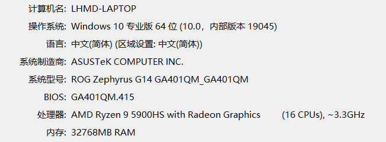
>
> ```
> Microsoft Visual Studio Professional 2017 
> 版本 15.9.59
> ```
>

## 实验内容

### 安装 OpenCV

使用安装程序安装 OpenCV 3.4.5

### 运行OpenCV程序

在 Visual C++ 中使用 OpenCV 编写一个简单的 Hello, OpenCV 程序，它将载入一个图片文件，显示在屏幕上。

### 操作 OpenCV 数据

阅读 OpenCV 文档的 Introduction 和 `core` 模块中 `cv::Mat` 类型的文档。

- Introduction: https://docs.opencv.org/3.4.5/d1/dfb/intro.html
- `cv::Mat`: https://docs.opencv.org/3.4.5/d3/d63/classcv_1_1Mat.html
- 参考文档的介绍，完成下面的任务：

    - 修改 Hello, OpenCV 的程序，使用`image.at<...>(...)`访问图像中的像素。

        - 图像的通道数是多少？每个通道是什么类型？
        - `at<...>` 的尖括号里要使用什么类型？
        - 提示：`Vec3b`
    - 遍历`image`的每个像素，将图像的白色部分修改为黑色。
    
        - 图像的长宽要怎么获得?
        - 图像的长和宽与矩阵的行数列数是什么关系？
        - 提示：`image.rows`，`image.cols`
    - 修改程序`image`将反色。

        - 尝试不遍历像素，直接用 `Mat` 的基本运算（减法）完成这个任务。
        - 提示：`Vec3b(255, 255, 255) - image`
        - 构造下面的 32×32 矩阵 M ，计算它的逆：
        - $\mathrm{M}=\begin{pmatrix}2&-1&0&&0\\-1&2&-1&\cdots&0\\0&-1&2&&0\\&\vdots&&\ddots&\vdots\\0&0&0&\cdots&2\end{pmatrix} $ 
        - 尝试将逆矩阵显示成一个灰度图，每个元素对应一个像素的亮度，最大值为白色，最小值为黑色。

## 理论分析

`cv::Mat`表示一个矩阵，同时也被用来表示图像。图像可以具有多个色彩通道，为了表示这种情形，`Mat`的元素可以是特殊的向量类型。

下面的代码构造了一个 32 x 32 的矩阵，它的元素是三通道的，每个通道内容是`float`类型：

```c
Mat m(32, 32, CV_32FC3);
```

`CV_32FC3`代表了这种三通道`float`类型，`32F`表示内容是32-bit的浮点数，`C3`代表三通道。类似地，`CV_8UC1`表示单通道`uchar`类型。
对于一个多通道矩阵，它的每个元素是一个向量，向量的维数是矩阵的通道数。OpenCV中使用特殊的`Vec`类型表示这类向量，`CV_32FC3`对应的向量类型是`Vec3f`。*单通道时，无需使用`Vec`类型，例如`CV_8UC1`对应的类型就是`uchar`。*

详细的类型可以参考：
http://docs.opencv.org/modules/core/doc/basic_structures.html#datatype

在访问矩阵元素时，可以使用`Mat::at<T>`方法，`T`对应于矩阵的元素类型。下面的代码获得到`m`矩阵第`i`行第`j`列处元素的引用：

```c
Vec3f &pix = m.at<Vec3f>(i,j);
```

矩阵有若干属性，常用的有行数，列数，矩阵的行数可以用`m.rows`获得，矩阵的列数可以用`m.cols`。
当矩阵用来表示图像时，图像的宽度对应了矩阵的列数，高度则对应了行数。一幅640x480图片可以按照如下方式构造：

```c
Mat img(480, 640, CV_8UC3);
```

注意长和宽在构造函数中出现的顺序。

下面的代码演示了如何遍历任务中`image`的元素，将白色区域替换为黑色：

```c
for(int i=0;i<image.rows;++i) {
    for(int j=0;j<image.cols;++j) {
        Vec3b &pixel = image.at<Vec3b>(i,j);
        if(Vec3b(255,255,255)==pixel) {
            pixel = Vec3b(0,0,0);
        }
    }
}
```

矩阵支持很多基本运算，下面的代码演示了如何构造一幅白色图像，用其减去已有图像来实现图像的反色：

```c
// 构造与原始图像大小相等，类型相同的白色图像
Mat white(image.size(), image.type(), Scalar(255, 255, 255));
// 利用矩阵减法实现反色
image = white - image;
```

下面的代码完成了本次实验课的最后一个任务，对于一个方阵，`Mat::inv()` 给出了它的逆：

```c
Mat L = 2.0*Mat::eye(32, 32, CV_32FC1); // 得到主对角线为 2 的矩阵
// 将两条副对角线赋值为 -1
for (int i = 1; i < 32; ++i) {
    L.at<float>(i-1, i) = -1;
    L.at<float>(i, i-1) = -1;
}
Mat Linv = L.inv(); // 计算 L 的逆
Mat result;
normalize(Linv, result, 1.0, 0.0, CV_MINMAX); // 重新映射，使最小值为黑，最大值为白
```

这里我们使用了很多 OpenCV 提供的便利函数，例如`eye`和`normalize`，你也可以利用前面介绍的元素遍历来获得矩阵的最小值和最大值，然后自行完成重映射。

> 早期的 OpenCV 使用了`CvMat`、`IplImage`等结构体来表示矩阵和图像等。它们需要使用专门的函数进行建立或销毁，容易产生资源泄漏或悬挂引用等问题。`cv::Mat`采用C++对象的生命周期来管理它的内容，可以更好的避免这类问题。我们不推荐使用早期的结构体类型。

## 实验细节

### Hello, OpenCV

在 Visual C++ 中新建一个空项目，项目名称为 `hellocv` ，在顶端栏目将`x86`改为`x64`。

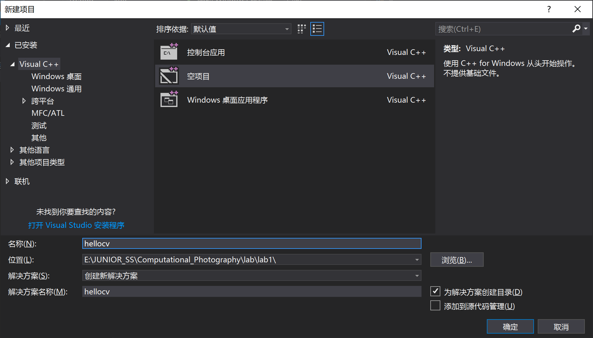

在 `hellocv` 项目中添加一个源代码文件

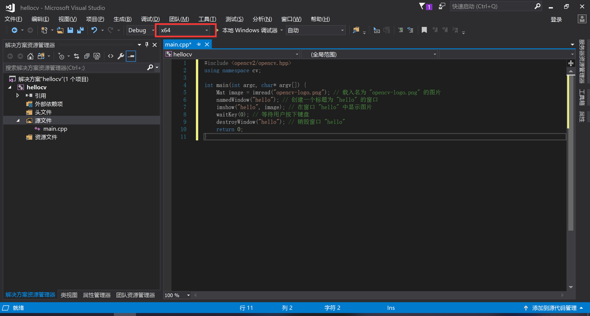

编译并链接到 OpenCV

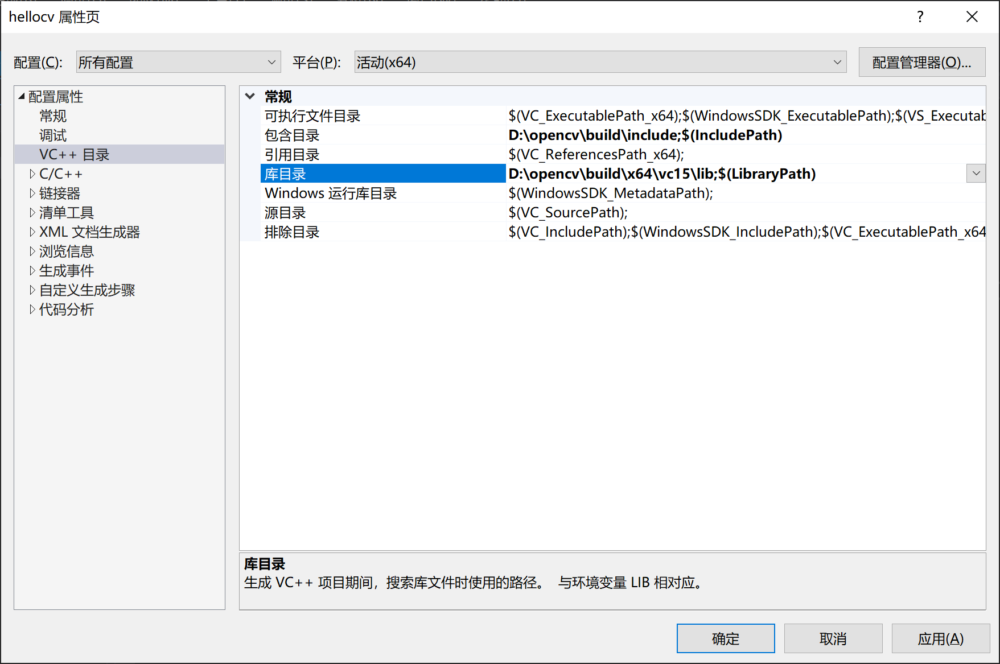

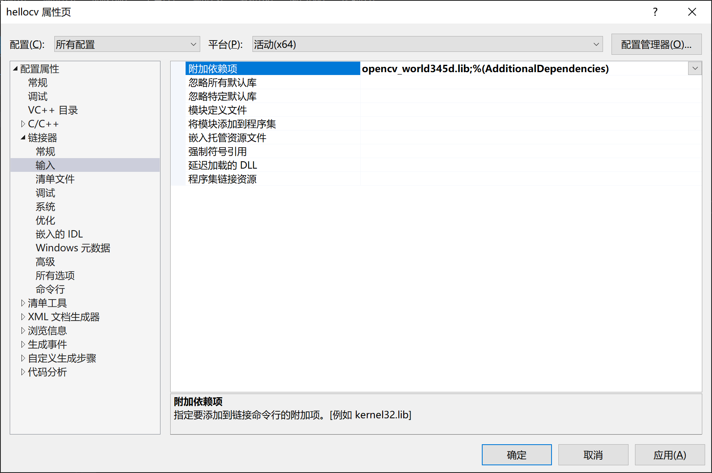

为了运行程序，将需要的`opencv/build/vc14_or_15/bin` 中的dll 文件（Debug对应`opencv_world345d.dll`，Release对应`opencv_world345.dll`）复制到你的程序 exe 所在的目录。

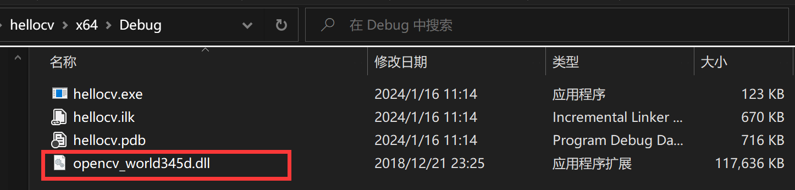

运行程序

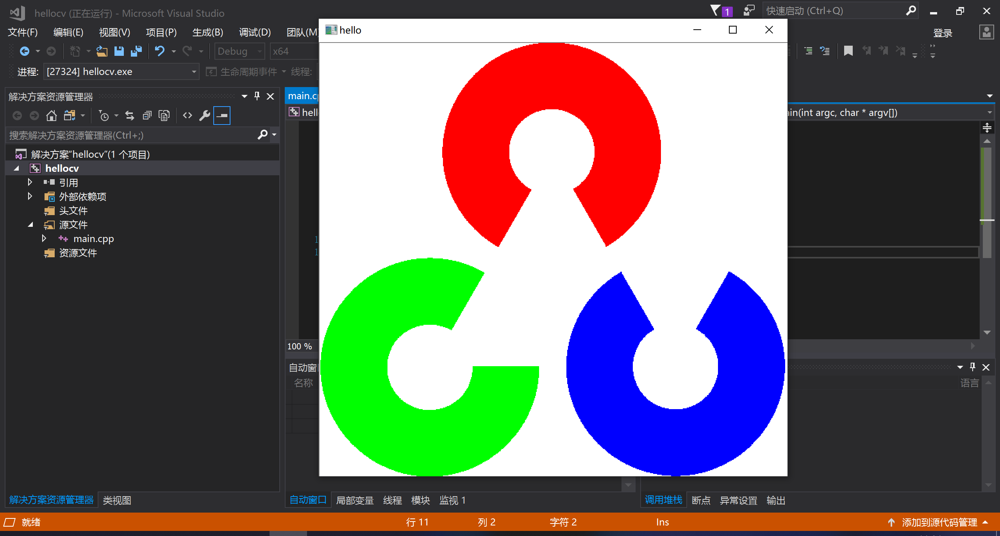

### 操作 OpenCV 数据

#### 访问像素

这是一个三通道的彩色图像。`at<...>` 的尖括号里要使用 `Vec3b` 类型，这是一个表示 3 个字节的向量（B, G, R），每个字节代表一个颜色通道的值。

```c++
// 访问像素
for (int y = 0; y < 50; y++) {
    for (int x = 0; x < 50; x++) {
        image.at<Vec3b>(y, x) = Vec3b(0, 0, 255); // BGR 格式
    }
}
```

访问图像左上角的50*50个像素点，将其更改为红色

#### 修改图像

在 OpenCV 中，图像的尺寸可以通过 `Mat` 对象的 `rows` 和 `cols` 属性获得。`image.rows` 表示图像的行数，而 `image.cols` 表示图像的列数。

图像的宽度对应于矩阵的列数 (`cols`)，而图像的高度对应于矩阵的行数 (`rows`)。

```c++
// 遍历图像的每个像素
for (int y = 0; y < image.rows; y++) {
    for (int x = 0; x < image.cols; x++) {
        // 获取当前像素的值
        Vec3b color = image.at<Vec3b>(y, x);

        // 检查是否为白色
        if (color[0] == 255 && color[1] == 255 && color[2] == 255) {
            // 将白色像素改为黑色
            image.at<Vec3b>(y, x) = Vec3b(0, 0, 0);
        }
    }
}
```

遍历 `image` 的每个像素，将图像的白色部分修改为黑色。

#### 反色

```c++
Mat white_image(image.size(), image.type(), Scalar(255, 255, 255));
Mat inverted_image = white_image - image;
```

不遍历像素，直接用 `Mat` 的基本运算（减法）将图片反色。

#### 矩阵操作

```c++
//矩阵M
const int size = 32;
Mat M = Mat::zeros(size, size, CV_32F);
for (int i = 0; i < size; i++) {
    M.at<float>(i, i) = 2.0;
    if (i > 0) {
        M.at<float>(i, i - 1) = -1.0;
        M.at<float>(i - 1, i) = -1.0;
    }
}
Mat M_inv = M.inv();
double minVal, maxVal;
minMaxLoc(M_inv, &minVal, &maxVal);
// 归一化逆矩阵的值到0-255范围
Mat normalized_M_inv;
M_inv.convertTo(normalized_M_inv, CV_8UC1, 255.0 / (maxVal - minVal), -minVal * 255.0 / (maxVal - minVal));
```

这里首先构造了一个 32x32 的矩阵 `M`，然后使用 `Mat::inv()` 方法计算其逆。逆矩阵中的值通过 `minMaxLoc` 函数找到最小值和最大值，并通过这些值进行归一化，使其范围在 0 到 255 之间。这样得到的 `normalized_M_inv` 矩阵就可以作为一个灰度图像显示了。

## 结果展示

原图展示：

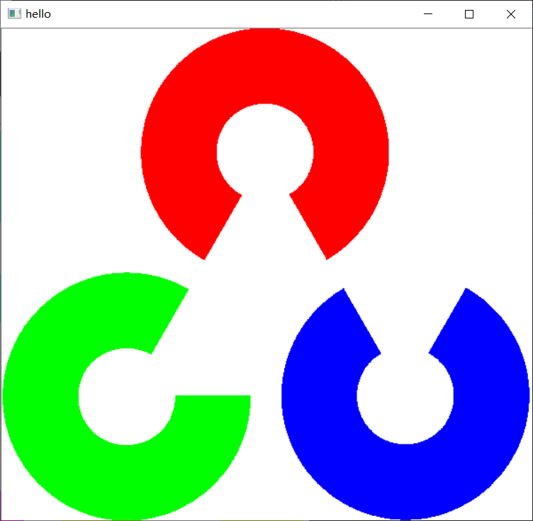

访问像素并更改：

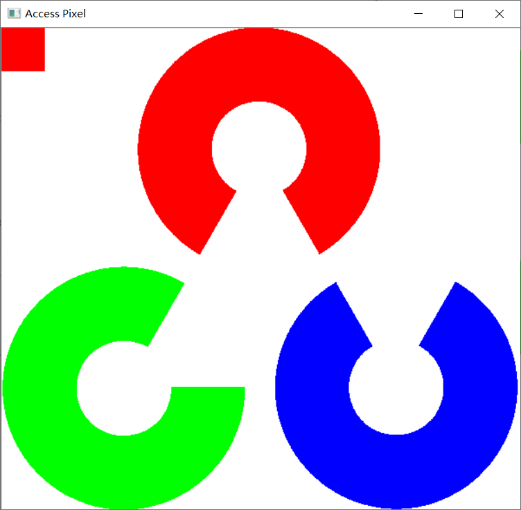

遍历图像修改：

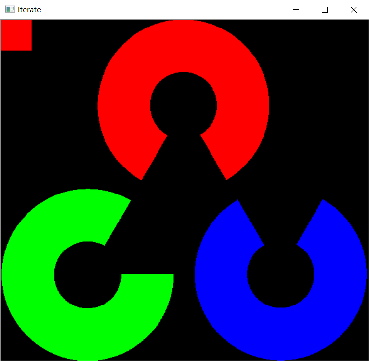

反色：

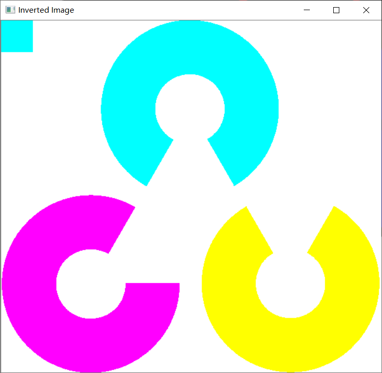

矩阵操作：

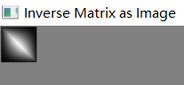
