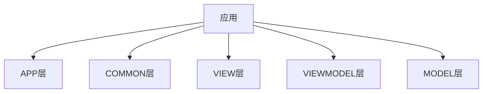

<div class="cover" style="page-break-after:always;font-family:方正公文仿宋;width:100%;height:100%;border:none;margin: 0 auto;text-align:center;">
    <div style="width:60%;margin: 0 auto;height:0;padding-bottom:10%;">
        </br>
        
    </div>
    </br></br></br></br></br>
    <div style="width:60%;margin: 0 auto;height:0;padding-bottom:40%;">
        
	</div>
    </br></br></br></br></br></br></br></br>
    <span style="font-family:华文黑体Bold;text-align:center;font-size:20pt;margin: 10pt auto;line-height:30pt;">魔方模拟器项目说明</span>
    <p style="text-align:center;font-size:14pt;margin: 0 auto"> </p>
    </br>
    </br>
    <table style="border:none;text-align:center;width:72%;font-family:仿宋;font-size:14px; margin: 0 auto;">
    <tbody style="font-family:方正公文仿宋;font-size:12pt;">
    	<tr style="font-weight:normal;"> 
    		<td style="width:20%;text-align:right;">授课教师</td>
    		<td style="width:2%">：</td> 
    		<td style="width:40%;font-weight:normal;border-bottom: 1px solid;text-align:center;font-family:华文仿宋">袁昕 </td>     </tr>
    	<tr style="font-weight:normal;"> 
    		<td style="width:20%;text-align:right;">组　　长</td>
    		<td style="width:2%">：</td> 
    		<td style="width:40%;font-weight:normal;border-bottom: 1px solid;text-align:center;font-family:华文仿宋"> 王伟杰</td>     </tr>
    	<tr style="font-weight:normal;"> 
    		<td style="width:20%;text-align:right;">组　　员</td>
    		<td style="width:2%">：</td> 
    		<td style="width:40%;font-weight:normal;border-bottom: 1px solid;text-align:center;font-family:华文仿宋"> 钟睿昕</td>     </tr>
    	<tr style="font-weight:normal;"> 
    		<td style="width:20%;text-align:right;">　　　　</td>
    		<td style="width:2%"></td> 
    		<td style="width:40%;font-weight:normal;border-bottom: 1px solid;text-align:center;font-family:华文仿宋"> 戴　卿</td>     </tr>
    	<tr style="font-weight:normal;"> 
    		<td style="width:20%;text-align:right;">组　　别</td>
    		<td style="width:%">：</td> 
    		<td style="width:40%;font-weight:normal;border-bottom: 1px solid;text-align:center;font-family:华文仿宋"> 魔方模拟组</td>     </tr>
    	<tr style="font-weight:normal;"> 
    		<td style="width:20%;text-align:right;">日　　期</td>
    		<td style="width:2%">：</td> 
    		<td style="width:40%;font-weight:normal;border-bottom: 1px solid;text-align:center;font-family:华文仿宋">2023-7-7</td>     </tr>
    </tbody>              
    </table>
</div>

<div STYLE="page-break-after: always;"></div>

## 项目介绍

### 项目说明

- 项目名称：魔方模拟器

- 开发小组名称：魔方模拟组

- 开发小组成员：王伟杰（组长）、戴卿、钟睿昕

### 项目背景

​    魔方模拟器是一个基于C++编程语言开发的应用程序，旨在提供一个实时、交互式的魔方解谜工具。在现实世界中，解开魔方可能需要花费大量的时间和精力，而通过模拟器，用户可以在计算机上模拟魔方的各种操作和解法，更加便捷的操作魔方，并高效地学习和掌握解谜技巧。该模拟器允许用户在图形界面中操作虚拟魔方，模拟真实的魔方操作过程和解法，通过使用计算机算法和交互界面，帮助用户更好地理解和掌握魔方的解法过程。

### 项目目标

​    完成该项目后，用户将拥有一个功能完善、易于使用的魔方模拟器应用程序。用户可以通过运行该程序，在计算机上模拟魔方的各种操作和解法过程，提高自己的解谜技巧，并学习魔方的解法。

​    该魔方模拟器的目标是为用户提供一个功能齐全、交互性强的魔方模拟平台，能够完成以下目标：
1. 提供魔方模拟器：开发一个魔方模拟器应用程序，实现在计算机上模拟魔方的各种操作和解谜过程。
2. 实时交互性：确保模拟器能够实时响应用户的操作，提供流畅的魔方操作体验，使用户感觉像是在操控真实的魔方一样。
3. 支持多种操作命令：实现支持各种操作命令，如旋转、视角移动、打乱、复原、存储文件等，以满足用户对魔方的灵活控制需求。
4. 提供解谜演示：能够根据用户的输入解谜步骤，展示魔方复原的过程，并支持动画效果，以帮助用户学习和理解解谜的技巧。
5. 支持求解算法：模拟器支持模仿复原通用算法，以满足用户的需求和挑战。

​	通过实现这些目标，该魔方模拟器将为魔方爱好者和初学者提供一个综合的学习和娱乐平台。用户可以通过模拟器的操作和演示功能，自由地探索和体验魔方解谜的乐趣，并逐步提高自己的解谜技巧。

### 项目用户

​    本项目面向对象为各层次水平魔方爱好者，包括魔方初学者、解谜爱好者、专业魔方选手等。

## 需求说明

1. 用户操作命令：实现对魔方进行旋转、视角移动等的操作命令。

2. 复原功能：实现SOLVE命令，能够解当前状态的魔方，并输出参考步骤。
3. 演示功能：实现PLAY命令，能够解当前状态的魔方，并以动画形式展示每一步的复原过程。
4. 随机打乱：实现RANDOM命令，能够随机转动魔方，模拟魔方的打乱状态。
5. 文件加载与保存：实现FILE命令，能够从文件中加载魔方表示，并能保存当前魔方状态为魔方表示。
6. 输入加载：实现LOAD CMD命令，能够从控制台输入魔方表示并加载。
10. 重置功能：实现RESET命令，能够重新开始一个新的魔方。

​	通过满足这些目标和需求，该魔方模拟器将提供一个全面的、灵活的魔方解谜平台，满足用户对于魔方操作、解谜和学习的多样化需求。

## 开发技术规划

### 第一轮迭代

- [ ] 正常显示魔方
- [ ] 视角移动
- [ ] 魔方旋转

### 第二轮迭代

- [ ] 随机打乱
- [ ] 文件存储
- [ ] 输入加载
- [ ] 重置魔方

### 第三轮迭代

- [ ] 魔方复原算法
- [ ] 自动复原演示

## MVVM模型规划



文件管理：

```bash
.
├── APP
│   ├── App
├── COMMON
│   ├── Config
│   ├── CubeError
│   ├── Macro
│   ├── SolverError
│   ├── types
│   ├── utilities
├── MODEL
│   ├── Cube
├── VIEW
│   ├── Input
│   ├── MainWindow
│   ├── Rendering
└── VIEWMODEL
    ├── CommandHandlers
    ├── CubeSolver
    ├── Filter
    ├── RotateController
```

## 开发工具

- 版本控制：github
- 开发环境：OpenGL
- 平台支持：Linux/Windows/MacOS
- 编程语言：C++17
- 框架结构：MVVM
- 文档编写：Markdown
- 构建工具：Xmake

## 小组分工

### 第一轮迭代

- 王伟杰：Common层+App层+xmake项目管理

- 戴卿：ViewModel层+Model层

- 钟睿昕：View层+文档撰写


### 第二轮迭代

- 王伟杰：View层+文档撰写

- 戴卿：Common层+App层

- 钟睿昕：ViewModel层+Model层


### 第三轮迭代

- 王伟杰：ViewModel层+Model层

- 戴卿：View层+文档撰写

- 钟睿昕：Common层+App层

<div STYLE="page-break-after: always;"></div>


## 预期演示效果


