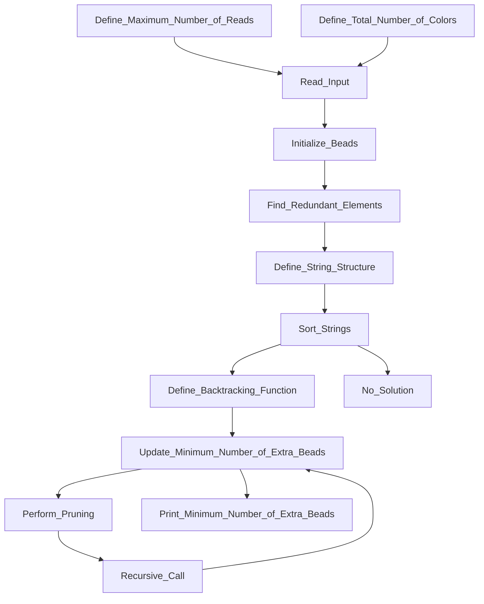
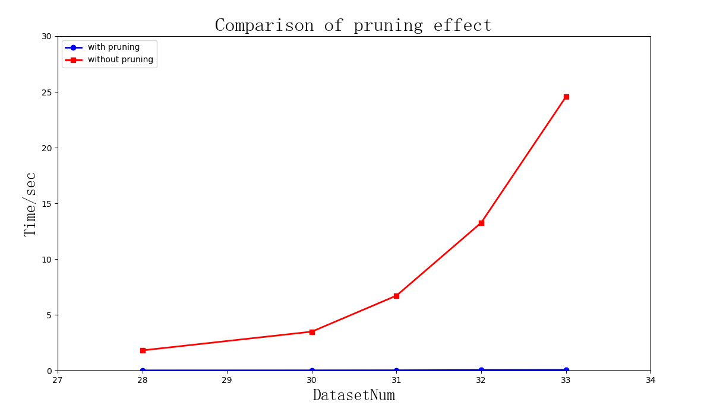
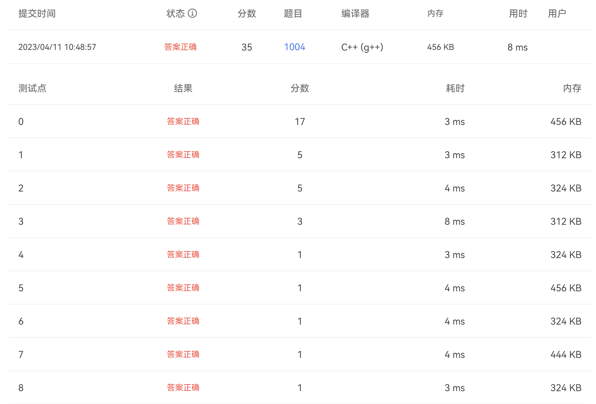

<br><br><br>

<center><div style='height:20mm;'></div><div style="font-family:Times New Roman;font-size:50pt;"> Title of Your Project</div></center>

<br><br><br><br><br><br><br><br><br><br><br><br><br><br><br><br><br><br>

<center><div style='height:15mm;'></div><div style="font-family:华文楷体;font-size:15pt;"> names </div></center>

<br><br><br><br><br><br><br><br><br>

<center><span style="font-family:Times New Roman;font-size:14pt;line-height:9mm">Date: 2023-4-5</span>
</center>


<div STYLE="page-break-after: always;"></div>

<center><div style='height:15mm;'></div><div style="font-family:Times New Roman;font-size:20pt;"> Contents</div></center><br><br>

[toc]

<div STYLE="page-break-after: always;"></div>

## Introduction

​	介绍一下题目，千万不要照抄PTA上面的原表述，会被扣分

## Data Structure / Algorithm Specification

### Data Structure

#### `map<char,int>mp`

​	A mapping data structure that stores **the character symbols of the beads** and **the id we assign**.

#### `struct Strand`

​	A structure that stores the information of **each string of beads**. It contains:

- `las`: represents the number of beads that are not the color we need.
- `val`: represents the number of beads that are the color we need, used for sorting.
- `cnt[]`: represents the number of beads of each color that we need in this string of beads.

#### `int cnt_target[BEAD], cnt_now[BEAD]`

- `cnt_target`: represents the number of beads of each color we need.
- `cnt_now`: represents the number of beads of each color we have now.

### Algorithm Specification

​	This algorithm solves the bead problem where a girl named Eva has to purchase some beads of certain colors to make bracelets. The objective of the algorithm is to determine the minimum number of beads that Eva needs to purchase to have the exact amount of each color needed to make bracelets for a given number of strings of beads.

#### Input

​	The algorithm can read input from **the console** or from **a file**, as chosen by the user. If the input is from the console, the input includes a string that contains all the bead colors needed, and an integer representing the total number of strings of beads, then all the . If the input is from a file, the user should input the file name, and the algorithm reads from the file, which should contain a string with all the bead colors needed and an integer representing the total number of strings of beads, followed by the bead strings themselves, one on each line.

#### Output

​	If there has a solution, output **the minimum number of extra beads** that Eva needs to purchase to have the exact amount of each color needed to make bracelets. Else output the number of beads missing from all the strings.

#### Procedure

1. Define the maximum number of reads and how many colors there are in total for the beads.
2. Read the input, either from the console or from a file.
3. Define a **map** to store the character symbols of the beads and the id assigned to each color.
4. **Initialize** all the beads read in and find out how many redundant elements each string has. Define a structure to **store the information of each string of beads**, including the number of beads that are not the color we need, the number of beads that are the color we need, and the number of beads of each color that we need in this string of beads.
5. **Sort the strings of beads** by their values, i.e., the number of beads that are the color we need, in descending order, then by the number of beads that are not the color we need, in ascending order.
6. Define **a backtracking function** to determine the minimum number of extra beads Eva needs to purchase. The function takes two arguments, **the current index** of the string of beads, and **the number of extra beads purchased so far**. The function will first check if Eva has already purchased enough beads of each color to make the bracelets. If so, it will **update the minimum number of extra beads** needed to the current number of extra beads purchased. If not, it will **recursively call itself** to check if adding the next string of beads will reduce the number of extra beads needed. The function will also perform pruning by checking if the current number of extra beads purchased plus the number of extra beads that would be needed if using the next string of beads is greater than or equal to the current minimum number of extra beads needed. If so, it will **skip that branch of the recursion**.
7. Print the minimum number of extra beads Eva needs to purchase.

This is the **flowchart** of program operation:




## Innovation

### Preprocessing

​	In this program, we performed preprocessing on the storage method of beads. Instead of using numbers 0-61 to represent 62 different types of beads, we only **assigned an index to the needed beads** and stored them in a map. When reading in the strands sold in the store, we calculated the number of needed and unneeded beads in each strand, as well as the number of each type of needed bead. We then **sorted the strands** based on the number of effective and ineffective beads, making it easier for subsequent calculations. The time complexity of reading in the preprocessed data is $O(∑len * log m)$. $%这个程序中我们对珠子的存储方式进行了预处理，我们不是使用0-61分别代表不同的62种珠子，而是仅仅对需要的珠子赋予一个索引，存储在map中。并且在读入商店中卖的strand的时候，就计算出每个strand中有多少我们需要的珠子、多少不需要的珠子和每种需要的珠子分别有多少个，并根据有效珠子和无效珠子的个数进行排序，方便后面运算。%$

### Pre-Judgment

​	If none of the strands sold in the store can meet our requirements, the output of this problem is "No". Calculating this scenario using the backtrack algorithm has a high time complexity of $O(m*2^{n})$. Therefore, we optimized this scenario by utilizing the sorting performed in the Preprocessing section to obtain the order of effective information for all strands in the store. We then purchased the strands in this order and checked if they meet the requirements. If they do, we proceed with the backtrack program as usual. If not, we output the result directly, thereby reducing the time complexity of the "**No Solution**" scenario to $O(n*m)$.$%如果买完商店里所有的strand都不能符合我们的要求，那么这道题的输出是"No"。通过backtrack算法进行计算这种情况的时间复杂度是O(m*2^{n})，这是很高的时间复杂度，所以我们针对这种情况做了优化。我们通过Preprocessing部分做的排序，可以获取商店里所有strands的有效信息排序情况，按照这个顺序依次购买，判断是否符合要求，如果能够符合要求，就正常进入backtrack程序，如果不行就直接输出结果，这样可以将"No solution"情况的时间复杂度降低到O(n*mlogn)。%$

### Pruning

​	In the backtrack algorithm, we perform pruning on each step. If the calculated `las` at a step exceeds the current minimum `las`, we exit the step and backtrack to the previous step to continue the search.$%在backtrack中，我们对每一步都进行剪枝的判断，如果这一步计算出的las已经超过了现有las的最小值，那么就直接退出这一步，回溯到上一步%$

​	When the last strand is found and still cannot meet the requirements, it can be determined that the right subtree of the current search tree cannot meet the conditions and can be pruned together.$%当搜索到最后一串时仍然无法满足要求，可以判断当前搜索树的右子树不能满足条件，可以将其一并剪去。%$

## Testing Results

### Input Test

The file directory structure is as follows

```bash
.
├── main.cpp
└── output
    ├── main.exe
    └── test.txt
```

After running the exe file, the output is as follows:

- Read from file

```
\code\output> main.exe
Please choose whether to read files or input from the console
1. Read from file
2. Input from console
1
Please enter the read file name
test.txt
Yes 3
```

The content of `test.txt` is as follows:

```txt
RYg5
8
gY5Ybf
8R5
12346789
gRg8h
5Y37
pRgYgbR52
8Y
8g
```

- Read from console

```
\code\output>main.exe
Please choose whether to read files or input from the console
1. Read from file
2. Input from console
2
YrRR8RRrY
3
ppRGrrYB225
8ppGrrB25
Zd6KrY
No 3
```

### Time Test

Time with pruning on big data:

```
Please choose whether to read files or input from the console
1. Read from file
2. Input from console
1
Please enter the read file name
test2.txt
Yes 8
ElapsedTime: 0.487
```

Time without pruning on big data:

```
Please choose whether to read files or input from the console
1. Read from file
2. Input from console
1
Please enter the read file name
test2.txt
Yes 8
ElapsedTime: 5.368
```

The following is a comparison of program runtime with and without pruning within a certain data range



### PTA Test

​	Our program successfully executes on the PTA program platform in only 8ms, this is far less than the time limit required by the question itself.



## Analysis and Comments

### Time complexity

#### Pre-Operation

​	The time complexity of the operation in the map is $O(logm)$, and the preprocessing involves processing the length of a strand, resulting in a time complexity of $O(∑len * log m)$. The time complexity for determining the "No Solution" case is $O(n*m)$.$%在map中的操作时间复杂度为O(logm)，读入预处理对一个strand的长度进行处理，所以时间复杂度为O(∑len * log m)。对于"No Solution"情况的判断时间复杂度为O(n*m)。%$

#### backtrack

​	The time complexity of the backtracking algorithm is $O(m*2^{n})$. However, the actual time complexity is much lower than the worst-case scenario due to the inclusion of pruning in the program.$%回溯算法的时间复杂度为O(m*2^{n})。因为程序包含剪枝，所以实际时间复杂度要远低于最坏情况。%$

#### Summary

​	From the above analysis, it can be seen that the overall time complexity is $O(m*2^{n})$.

### Space complexity

​	The space complexity of the algorithm is $O(m)$ to store the count of each bead color needed and $O(n*m)$ to store the information of each string of beads.

## Appendix: Source Code

```c++
课程要求，不允许公开代码
```

## References

［1］  Advanced Data Structure Slides "Backtracking". https://tcmedia.zju.edu.cn/download/processed/d1e59f3d22b9d9aab55bbbb13dd2caa27a139b87.pdf?timestamp=1680699600&token=4a488ec205693b232926adafbec3994e&name=ADS06Backtracking_Stu%282%29.pdf

## Author List

- Author1：Depth first search function and report writing
- Author2：Program optimization, pretreatment and report writing
- Author3：Main function and PPT production

## Declaration

​	***We hereby declare that all the work done in this project titled "xxxxxxx" is of our independent effort as a group.***

## Signatures

<center>签名</center>
